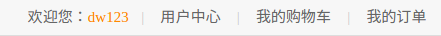

# Django Scrapy Statistics 
Django web projection

大家有时间多想一想，增加自己的想法

## Stage 1
---
time: 2017-7-31

1. 项目设定探讨
2. 招兵买马
3. 技能补充
4. 项目分工
---
time: 2017-8-01

1. 大家把自己的分支建立好
2. 对于web工程有什么想法，可以更新到自己分支的.md文件里
3. 以后的日志也可以更新到自己的分支.md文件里
4. 如果自己分支的.md文件不想添加并上传至远程仓库，使用以下命令，Git会忽略该文件：
```bash
$ echo "自己的文件.md" >> .gitignore
```
5. 将本地分支追踪服务器远程分支，分支就是名字的字母缩写：
```bash
$ git branch --set-upstream-to=origin/YourName YourName
```
---
time: 2017-8-1

#### 注意事项
- python3 创建项目，数据迁移前，在项目里面的项目同名文件夹的`__init__.py`文件里面，加入：

```python
import pymysql

pymysql.install_as_MySQLdb()
```
- 可以考虑利用装饰器保持登陆状态：
```python
from django.shortcuts import render


def _login(func):
    def wrapper(request):
        if 'islogin' in request.session:
            islogin = request.session['islogin']
                if islogin:
                    user = request.session['username']
                    if user:
                        return render(request, 'base.html', {'username':user})
                else:
                    return func(request)

    return wrapper

# 用法
@_login
def some_function():
    pass

```
问题是如何自动获取待渲染页面文件作为参数
- 给管理类抽象出基本管理类
```python
from django.db import models


# 基类管理类
class BaseModelManager(models.Manager):
    # 根据参数自动判断有效字段并添加
        def add_one(self, **kwargs):
            # 获取类，就是Manager类
            cls = self.model
            kw = kwargs.copy()
            for k in kw:
                # 获取有效属性参数，无效的直接剔除
                if k not in cls._meta.get_all_field_names():
                    kwargs.pop(k)

            # 实例化
            obj = cls(**kwargs)

            obj.save()
            return obj
```
- 通过给模板变量赋值，更改页面的登陆状态：


