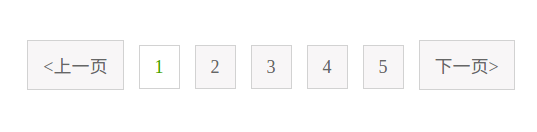
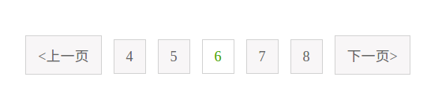
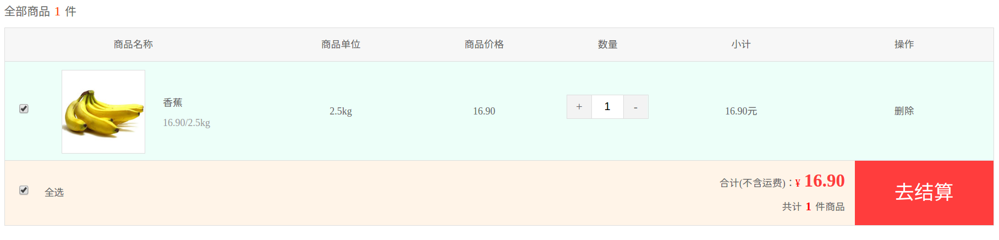
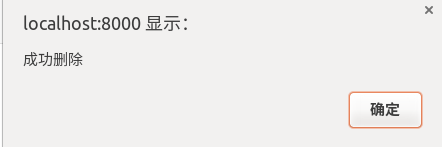
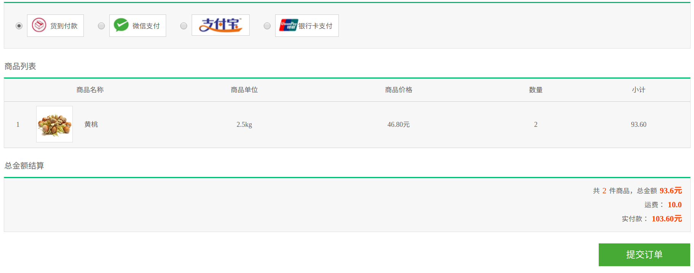
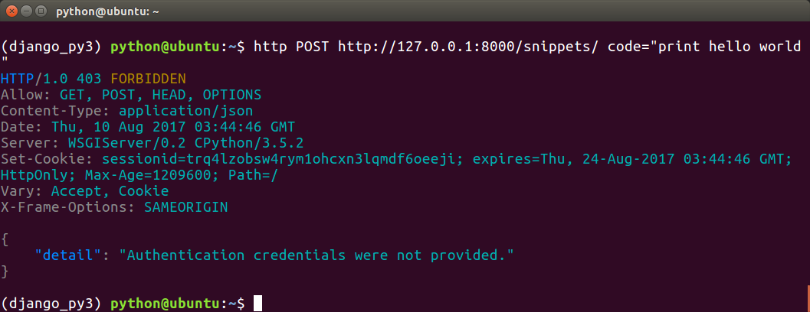
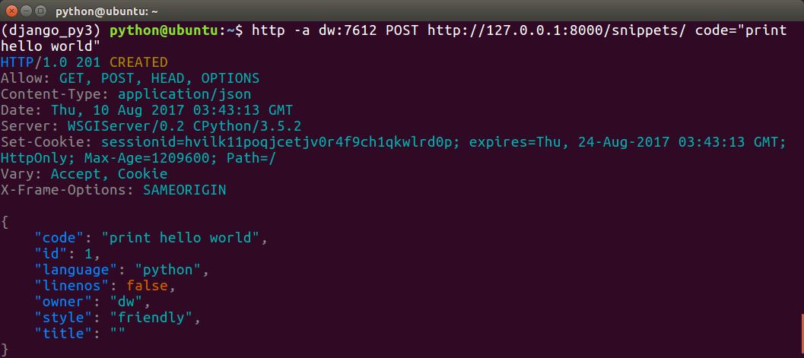

# Django Scrapy Statistics 
Django web projection

大家有时间多想一想，增加自己的想法

## Stage 1
---
time: 2017-7-31

1. 项目设定探讨
2. 招兵买马
3. 技能补充
4. 项目分工
---
time: 2017-8-01

1. 大家把自己的分支建立好
2. 对于web工程有什么想法，可以更新到自己分支的.md文件里
3. 以后的日志也可以更新到自己的分支.md文件里
4. 如果自己分支的.md文件不想添加并上传至远程仓库，使用以下命令，Git会忽略该文件：
```bash
$ echo "自己的文件.md" >> .gitignore
```
5. 将本地分支追踪服务器远程分支，分支就是名字的字母缩写：
```bash
$ git branch --set-upstream-to=origin/YourName YourName
```
---
time: 2017-8-1

#### 注意事项
- python3 创建项目，数据迁移前，在项目里面的项目同名文件夹的`__init__.py`文件里面，加入：

```python
import pymysql

pymysql.install_as_MySQLdb()
```
- 可以考虑利用装饰器保持登陆状态：
```python
from django.shortcuts import render


def _login(func):
    def wrapper(request):
        if 'islogin' in request.session:
            islogin = request.session['islogin']
                if islogin:
                    user = request.session['username']
                    if user:
                        return render(request, 'base.html', {'username':user})
                else:
                    return func(request)

    return wrapper

# 用法
@_login
def some_function():
    pass

```
问题是如何自动获取待渲染页面文件作为参数
- 给管理类抽象出基本管理类
```python
from django.db import models


# 基类管理类
class BaseModelManager(models.Manager):

    def get_valid_fields(self):
        """
        获取模型管理器对象所在模型类的属性列表
        """
        # 获取模型管理器对象所在的模型类
        cls = self.model
        # 获取cls模型类的属性列表
        attr_list = cls._meta.get_fields()
        attr_str_list = []
        for attr in attr_list:
            if isinstance(attr, models.ForeignKey):
                attr.name = '%s_id'%attr.name
                attr_str_list.append(attr.name)
        return attr_str_list
                
    # 根据参数自动判断有效字段并添加
    def add_one(self, **kwargs):
        # 获取类，就是Manager类
        cls = self.model
        kw = kwargs.copy()
        for k in kw:
            # 获取有效属性参数，无效的直接剔除
            if k not in self.get_valid_fields():
                kwargs.pop(k)
        # 实例化
        obj = cls(**kwargs)

        obj.save()
        return obj

    ...
```
- 通过给模板变量赋值，更改页面的登陆状态：


---
time: 2017-8-5

#### 对Page inator 部分做了改进
1. `上一页`和`下一页`始终显示，且始终显示5条page按键




2. 数字较大的页面始终显示在中间



---
time: 2017-8-8

#### 完善购物车界面同时利用ajax的GET方法更新数据库后台
1. 页面信息展示和数量操作



2. 删除功能



---
time: 2017-8-9
1. 引入事务
```python
from django.db import transaction
@transaction.atomic
def my_view(request):
    # 事务保存点
    save_id = transaction.savepoint()
    try:
        ...
        transaction.savepoint_commit(save_id)
    except Exception as e:
        transaction.savepoint_rollback(save_id)
```
2. 支付界面



---
time: 2017-8-10

#### Django REST framework
1. 将模型关联到用户模型上，在模型中增加字段
```python
owner = models.ForeignKey('auth.User', related_name='snippets', on_delete=models.CASCADE)
```

2. 定义用户模型
```python
from django.contrib.auth.models import User

class UserSerializer(serializers.ModelSerializer):
        snippets = serializers.PrimaryKeyRelatedField(many=True, queryset=Snippet.objects.all())
        class Meta:
            model = User
            fields = ('id', 'username', 'snippets')
```
`PrimaryKeyRelated`指定`snippets`关联多个主键

3. 定义用户视图
```python
from django.contrib.auth.models import User


class UserList(generics.ListAPIView):
    queryset = User.objects.all()
    serializer_class = UserSerializer


class UserDetail(generics.RetrieveAPIView):
    queryset = User.objects.all()
    serializer_class = UserSerializer
```
4. 定义用户url
```python
url(r'^users/$', views.UserList.as_view()),
url(r'^users/(?P<pk>[0-9]+)/$', views.UserDetail.as_view()),
```
5. 因为已经在应用模型中定义了`owner`字段，则保存时关联user:
```python
def perform_create(self, serializer):
    serializer.save(owner=self.request.user)
```
6. 模型的Serializer模型中添加字段`owner`并且注册到`Meta`的`field`里面:
```python
class SnippetSerializer(serializers.ModelSerializer):
    owner = serializers.ReadOnlyField(source='owner.username')
    class Meta:
        model = Snippet
        fields = ('id', 'owner', 'code', 'title', 'linenos', 'language', 'style')
```
7. 应用模型与用户关联好之后，需要在视图类里面添加许可，这样就能限制不同用户对应用的增删改查等行为了
```python
from rest_framework import permissions
permission_classes = (permissions.IsAuthenticatedOrReadOnly,)
```
8. 在工程同名文件夹里面，增加用户登陆页面视图，REST自带的：
```python
urlpatterns += [
    url(r'^api-auth/', include('rest_framework.urls',namespace='rest_framework')),
]
```
9. 测试，事先安装`httpie`，不登陆进行POST提交，没有权限，失败了



10. 测试，登陆之后才拥有创建的权限:


